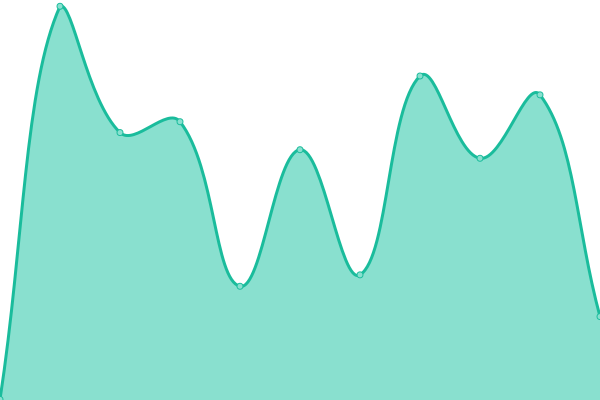

# [📈 Live Status](https://demo.upptime.js.org): <!--live status--> **🟩 All systems operational**

This repository contains the open-source uptime monitor and status page for [Source++](https://sourceplus.plus), powered by [Upptime](https://github.com/upptime/upptime).

<!--start: status pages-->
<!-- This summary is generated by Upptime (https://github.com/upptime/upptime) -->
<!-- Do not edit this manually, your changes will be overwritten -->
<!-- prettier-ignore -->
| URL | Status | History | Response Time | Uptime |
| --- | ------ | ------- | ------------- | ------ |
|  [Demo Server](https://demo.sourceplus.plus) | 🟩 Up | [demo-server.yml](https://github.com/sourceplusplus/status/commits/HEAD/history/demo-server.yml) | 

 432ms
     
 | 

<a href="https://status.sourceplus.plus/history/demo-server">100.00%</a>
    

|  [Website](https://sourceplus.plus) | 🟩 Up | [website.yml](https://github.com/sourceplusplus/status/commits/HEAD/history/website.yml) | 

 644ms
     
 | 

<a href="https://status.sourceplus.plus/history/website">100.00%</a>
    

<!--end: status pages-->

[**Visit our status website →**](https://status.sourceplus.plus)

## 📄 License

- Powered by: [Upptime](https://github.com/upptime/upptime)
- Code: [MIT](./LICENSE) © [Source++](https://sourceplus.plus)
- Data in the `./history` directory: [Open Database License](https://opendatacommons.org/licenses/odbl/1-0/)
